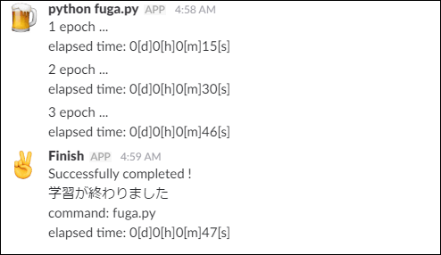
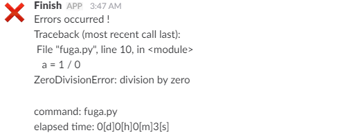

# slack_notifier
Slackへのメッセージ・終了通知を投稿するためのライブラリ



### 特徴

* 簡単にSlackの#channelや@userにメッセージを投稿
    * 「実行したコマンド名」「プログラムの実行時間」も通知可能
* プログラムが終了した時に自動でメッセージを投稿
    * プログラムが正常終了したのか異常終了したのかを判別して通知
    * 異常終了の場合はtracebackの情報も合せて通知

### こんなときにどうぞ
* 時間のかかるプログラムがどこまで進んだのか知りたいとき
* 時間のかかるプログラムがいつ終わったのか知りたいとき
* Deep Learningの学習の際にepoch毎の経過時間を知りたいとき
* Slackに#GPUなどのチャンネルを作り，プログラムが終わった際にGPUを使い終わったことを自動で他のメンバに知らせたいとき

### インストール方法

```bash
sudo pip3 install git+https://github.com/t-yamamura/slack_notifier.git
```

または，ダウンロードして```setup.py```でインストール

```bash
sudo python3 setup.py install
```

### 利用方法

#### 1.メッセージ投稿
環境変数"WEBHOOK_URL"を設定して以下のようにURLを設定するだけでOK


```python
import os
from slack_notifier import SlackNotifier

sn = SlackNotifier(os.environ['WEBHOOK_URL'])
sn.send_message("Hello") # slackにメッセージを送る
```

send_message()の引数には，投稿先(channel)やユーザ名(username)などを指定して投稿することができます．  
icon_emojiで利用できる絵文字は，[Emoji cheat sheet](https://www.webpagefx.com/tools/emoji-cheat-sheet/)などを参考にしてください．

```python
import os
from slack_notifier import SlackNotifier

sn.send_message("Hello", username='t_yamamura')   # ユーザ名をt_yamamuraに設定
sn.send_message("Hello", icon_emoji=':ok_woman:') # アイコンを:ok_woman:に設定
sn.send_message("Hello", channel='@t_yamamura')   # ユーザ(@t_yamamura)にメッセージを送る
sn.send_message("Hello", channel='#GPU')          # チャンネル(#GPU)にメッセージを送る
sn.send_message("@t_yamamura Hello", link_name=1) # メンションを有効にする
sn.send_message("Hello", add_command_info=True)   # メッセージに実行しているコマンド名を追加
sn.send_message("Hello", add_elapsed_time=True)   # メッセージにプログラムの経過時間を追加
```

send_message()のデフォルト引数の説明とデフォルト値は，以下のようになっています．

|引数|説明|デフォルト値|
|--|:--:|:--:|
|username (optional)|ユーザ名(投稿者)|実行しているコマンド (e.g. python hoge.py)|
|icon_emoji (optional)|アイコン|:snake:|
|channel (optional)|投稿先|#python_webhook|
|link_names (optional)|メンション| 0 (有効にしない)|
|add_command_info (optional)|コマンド名を追加| False (追加しない)|
|add_elapsed_time (optional)|経過時間を追加| False (追加しない)|

> **補足**

> 経過時間とは，インスタンス生成時(SlackNotifierの呼び出し時)からsend_message()が実行された間の実行時間です．  
> そのため，SlackNotifierはプログラムのmainの冒頭で呼び出すと良いです


#### 2. デフォルト値の設定

SlackNotifier()の引数に，send_message()に適用するデフォルト値(ユーザ名，アイコン，投稿先，メンション)を設定することができます．  
もちろん，デフォルト値は指定しなくても構いません(ユーザ名だけ指定するということもできます)．

```python
import os
from slack_notifier import SlackNotifier

sn = SlackNotifier(os.environ['WEBHOOK_URL'], default_user="t_yamamura",
                                              default_icon=":ok_woman:",
                                              default_channel="@t_yamamura",
                                              default_link=1)
sn.send_message("@t_yamamura Hello") # デフォルト値を適用してメッセージを投稿
```


#### 3.プログラムの終了時にメッセージを送る

SlackNotifier()の引数に"end=True"を指定すると，プログラムの終了時にメッセージを送ることができます．  
default_channelを指定していない場合は，**"#python_webhook"のチャンネルに終了通知が届く**ので，default_channelを指定しておくことをおすすめします．


```python
import os
from slack_notifier import SlackNotifier

# プログラムが終了したときに自動で@t_yamamuraにメッセージを送る
sn = SlackNotifier(os.environ['WEBHOOK_URL'], default_channel="@t_yamamura", end=True)
```

**プログラムが正常終了した場合：**


**プログラムが異常終了した場合(例外発生)：**



また，"end_message"を指定して，任意のメッセージを追加することができます．

```python
sn = SlackNotifier(os.environ['WEBHOOK_URL'], default_channel="@t_yamamura", end=True, end_message="終わったよー")
```


> **補足**

> + except節で捕捉されていない例外が発生した場合に，異常終了と判定されます  
> + そのため，try-except節で例外が発生しても，正常終了と判定されます  
> + 実行中のプログラムがkillされたりos._exit()が呼び出された場合は，終了時にメッセージが送信されません ([atexit](https://docs.python.jp/3/library/atexit.html)を参照)  


### 応用

#### メッセージにリンクをつけたい場合

URLを```<>```で囲えばOKです．  
また，URLのバー(```|```)以降に表示する文字を設定することができます．

```python
sn.send_message("<https://slack.com>")
```


```python
sn.send_message("<https://slack.com|jump to slack>")
```


#### Proxyの設定をしたい場合

このライブラリはrequests.postを用いて実装しています．  
send_message()にrequests.postのキーワード引数を渡すことで，proxyやtimeoutなどの設定をすることができます．

```python
sn.send_message("hello", proxies={"http":"http://proxy_hoge:8080", "https":"https://proxy_hoge:8080"})
```


### Links
* [Incoming Webhooks | Slack](https://api.slack.com/incoming-webhooks)
* [Emoji cheat sheet for GitHub, Basecamp and other services](https://www.webpagefx.com/tools/emoji-cheat-sheet/)
